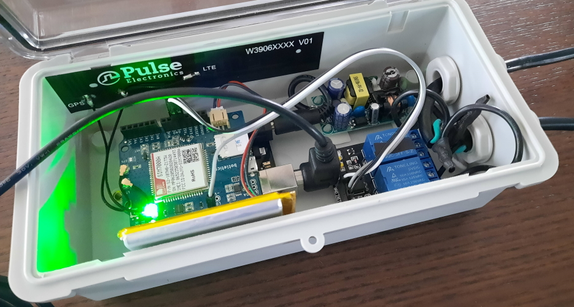
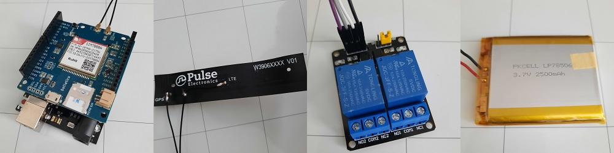

## Arduino IoT Switch


This project is for a remote AC outlet switch that is made using an Arduino microcontroller. This
was achieved using the [Blynk IoT platform and libraries](https://docs.blynk.io/en/), which creates a neat smartphone
application interface for interacting with the microcontroller.

<p align="right"></p>

### Components


1. [ELEGOO UNO R3 Board ATmega328P with USB Cable (Arduino UNO Clone)](https://www.elegoo.com/products/elegoo-uno-r3-board)
	- Acts as the main board, and is fully compatible with Arduino.
2. [Botletics™ SIM7000A LTE CAT-M1/NB-IoT + GPS Shield Kit](https://www.botletics.com/products/sim7000-shield)
	- This kit acts as a modem, and also offers future expanability.
3. [1NCE FlexSIM Card](https://1nce.com/en/sim-cards/)
	- This pre-paid SIM card is offered for 10 years with a 500 MB limit, making it perfect for low-bandwith IoT devices.
	- TCP was chosen over SMS, as the 1NCE SIM Card only has an SMS limit of 250 messages, which is not enough for the 10 year period.
4. [MCIGICM 2 Channel DC 5V Relay Module for Arduino UNO](https://www.amazon.com/gp/product/B072BY3KJF?psc=1)
	- Opto-isolated relay for maximum safety of the outlet.
5. [Adafruit 328 Lithium Ion Battery, 3.7V, 2500mAh](https://www.adafruit.com/product/328)
	- Provides additional current capability during the device start-up.

<p align="right"></p>

### Operation

**Blynk Heartbeat Configuration**
- As the devices with 1NCE connectivity are placed behind a NAT gateway, the public IP traffic is routed through the NAT Gateway/Internet Breakout. 
After 350 seconds of no packets being transmitted, the established connection via the Internet Breakout will be closed automatically. 
To keep the connection alive within 350 seconds a device must send a keep-alive packet at least once in the 350-second timeframe. 
Otherwise, the device must re-establish the connection after 350 seconds. The default heartbeat interval for GSM is 60 seconds, but you can
adjust it to suit your application. When setting the Blynk heartbeat, the following formula is applied: ***heartbeat interval = time * 2.3***.
For example, with a 300 second heartbeat you will get a notification regarding the connection status with a 12 minute delay in the worst case.

**Checking Signal Quality**
- The signal quality is measured in dBm as per IEEE RSSI specification. However the device does not return a dBm value. Instead it
gives a number from 2-30, which corresponds to a predefined level of signal strength. In the program, I have included this last
conversion before transmitting the current signal strength via Blynk. The values and their respective RSSI dBm measurements [can be found here.](https://m2msupport.net/m2msupport/atcsq-signal-quality/)

<p align="right"></p>

### Dependancies

**This project was built using specific versions of the libraries, which are included in the release.**
**Using newer/current versions of the libraries may break functionality.**

How To Install Libraries:
1. [Download the latest release from here](https://github.com/AlexWaclawik/Arduino-IoT-Switch/releases)
2. Unzip the contents. The necessary libraries are located in ```/include```
3. Place the dependancies into your Arduino Libraries Folder
	- On Windows: ```C:\Users\user\Documents\Arduino\libraries```
	- On Linux: ``` ~/home/user/sketchbook/libraries```
	- On Mac: ``` ~/Documents/Arduino/libraries```

<p align="right"></p>

### Credits

-	[Project idea inspired by video from GaryExplains](https://www.youtube.com/watch?v=7swG4XVSx50)
-	[TinyGSM by Volodymyr Shymanskyy](https://github.com/vshymanskyy/TinyGSM)
-	[Blynk](https://github.com/blynkkk/blynk-library)

<p align="right"></p>
